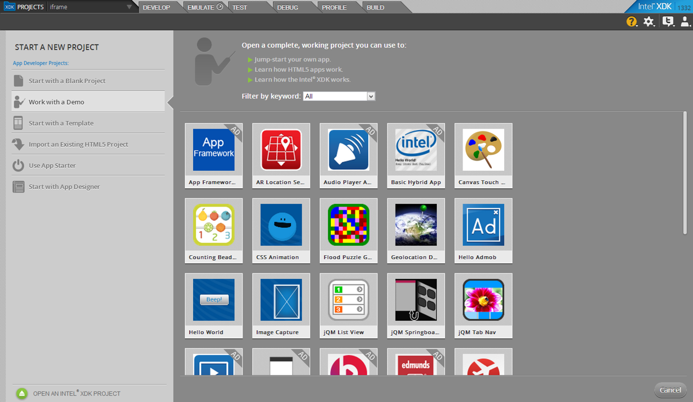
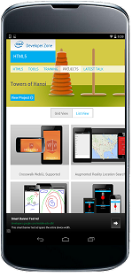
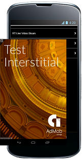

## HTML5 Hybrid Apps with Admob* Cordova* Plug-in

_The source code for these samples can be found here: [https://github.com/gomobile/sample-url-app](https://github.com/gomobile/sample-url-app),_ _[https://github.com/gomobile/sample-live-video-streams](https://github.com/gomobile/sample-live-video-streams "https://github.com/gomobile/sample-live-video-streams"), [https://github.com/gomobile/sample-audio-player](https://github.com/gomobile/sample-audio-player "https://github.com/gomobile/sample-audio-player") or download the_ [Intel® XDK](https://software.intel.com/en-us/html5/tools) to check out all of the HTML5 samples and templates.

## Introduction

Intel XDK® is a HTML5 hybrid application development environment that allow users to develop, debug, test on-device and build projects for various mobile platforms. Along with development features, this development environment provides various HTML5 templates and samples intended for running on various mobile devices and platforms. For more information on getting started, go to the [Intel XDK Overview](/en-us/xdk/docs/intel-xdk-overview).

## Purpose

Amongst developing HTML5 hybrid applications for various mobile platforms using Intel XDK Build system with the intent to distribute as a paid app alone, these applications can also be integrated with ads such as [AdMob*](https://www.google.com/ads/admob/index.html) banner and interstitial ads which also generate revenues for the respective app developer. By leveraging the [Apache Cordova* plug-ins](http://plugins.cordova.io/#/), you can develop compelling HTML5 hybrid apps for any platform and use case. [Apache Cordova](http://cordova.apache.org/) is a set of device APIs that allow a mobile app developer to access native device function such as the camera or accelerometer from JavaScript. Besides the standard APIs, various plug-ins are available in the [Apache Cordova Plug-ins Registry](http://plugins.cordova.io/#/) and located across the web on github. For example, the [com.google.admob](http://plugins.cordova.io/#/package/com.google.admob) Cordova plug-in provides the capability to initiate Banner and Interstitial ads as well as handle admob ad events.

## Design Considerations

The URL/iFrame, Live Video Streams and Audio Player App are designed using Intel XDK App Designer tool under the Develop Tab. All of those sample applications also uses the [com.google.admob](http://plugins.cordova.io/#/package/com.google.admob) Cordova plug-in for displaying ads on screen. An Google/AdMob account is required to obtain an ad unit id for displaying banner or interstitial ads on the desired platform.

### Creating AdMob Ad Unit ID

1.  Login to [https://apps.admob.com](https://apps.admob.com "https://apps.admob.com")
2.  Navigate to the Monetize panel
3.  Click the _Monetize new app_ button
4.  Input your App name, and desired mobile Platform
5.  Select ad format and name ad unit
6.  Review setup instructions

The URL/iFrame App is a simple application that displays within your application using an iframe. iFrames within mobile apps are widely used in various mobile app stores for directing traffic to mobile optimized sites as well as utilized the already in place infrastructures.

The Live Video Streams app is a simple multi-page application that uses [Intel App Framework UI JavaScript Library](http://app-framework-software.intel.com/) and iframes to display online video streams of live content from various source.

The Audio Player App demonstrates how to play audio files local to the HTML5 project, online podcast, online .m3u playlist and files on device.

**Note: Intel XDK only supports playing *.wav files in the Emulator under the Emulate tab.**

## Development /Testing

Due to the limited mobile platforms supported by the [com.google.admob](http://plugins.cordova.io/#/package/com.google.admob) Cordova plug-in, these sample applications have been tested on iOS and Android devices.

### Google Admob Cordova Plug-in Code Snippet

<pre class="brush:jscript">/*
    Function: onDocLoad()
    Parameter: none
    Description: show the Banner Ad [initBanner(...) then showBanner(...)] or interstitial Ad [initInterstitial(...) then cacheInterstitial() then showInterstitial()]; 
*/
function onDocLoad() {
    //show Banner ad
    //admobAd.initBanner(admob_banner_key, admobAd.AD_SIZE.BANNER.width, admobAd.AD_SIZE.BANNER.height);//create admob banner
    //admobAd.showBanner(admobAd.AD_POSITION.BOTTOM_CENTER);

    //show Interstitial ad
    admobAd.initInterstitial(admob_interstitial_key);//create Interstitial ad
    //admobAd.cacheInterstitial();// load admob Interstitial
    document.addEventListener(admobAd.AdEvent.onInterstitialReceive, onInterstitialReceive, false);
    document.addEventListener(admobAd.AdEvent.onInterstitialFailedReceive, onReceiveFail, false);

    admobAd.cacheInterstitial();// load admob Interstitial
}</pre>

**Note:** You can download the entire source for the plugin at [http://sourceforge.net/projects/phonegap-admob/](http://sourceforge.net/projects/phonegap-admob/ "http://sourceforge.net/projects/phonegap-admob/").